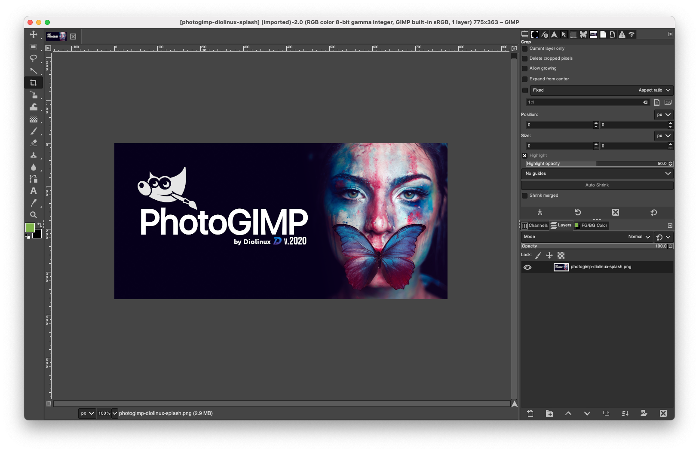

# 🎨 PhotoGIMP


A patch for optimizing GIMP 2.10+ for Adobe Photoshop users, including features like:

* Tool organization to mimic the position of Adobe Photoshop;
* New Python filters installed by default, such as "heal selection";
* New Splash Screen
* New default settings to maximize space on the canvas;
* Shortcuts similar to the ones in Photoshop for Windows, following Adobe’s Documentation;
* New icon and Name from custom .desktop file.
* System Language is now used by default, you can still change in settings if you want.


**📷 Screenshots**




## ⚙ How to Install (using Flatpak)

This package is all about flatpak, but it also contains "just files" that you can use on any version of GIMP (.deb, .rpm, Snap, AppImage, Windows, macOS). Just check the location of the GIMP configuration files.

**Start and quit GIMP after you installed before you continue!**

### Prepare the Flatpak enviroment

*If you have previously had GIMP installed via .deb, .rpm, etc., please ensure you delete the directory `$HOME/.config/GIMP`, as this may cause conflicts with the Flatpak config files.*
* First of all, you need to have the latest GIMP installed on your system [using Flatpak](https://flatpak.org/setup/)
* Install GIMP Flatpak through your AppCenter/Package Manager or terminal:
```flatpak install flathub org.gimp.GIMP```

### Install PhotoGIMP

Inside the .zip file from the [releases page](https://github.com/Diolinux/PhotoGIMP/releases) you’ll find three folders (hidden on non-Windows systems as their names begin with a dot). All of these folders have to be extracted to your `$HOME` folder, overwriting everything if you already have the same files from an older installation.

The file contains these directories:

* `.icons` (which has a new PhotoGIMP icon)
* `.local` (which contains the personalized .desktop file)
* `.var` (which contains the flatpak patch customization for GIMP 2.10+)

If you just want the PhotoGIMP customization without changing the original GIMP icon and its name, just extract only the ```.var``` folder to your home directory.

## ⚙ How to Install (others)

Since it’s just files, the only thing you need to do is to copy all the files that reside on a particular folder from this package `/.var/app/org.gimp.GIMP/config/GIMP/2.10` to your GIMP’s configuration folder on each particular system, overriding the existent ones.

**Start and quit GIMP after you installed before you continue!**

The new icon needs to be set manually.

### Ubuntu Snap

Configuration folder: `$HOME/snap/gimp/47/.config/GIMP/2.10/`

### Other Linux or Unix(-like) systems (.deb, .rpm, etc.)

Configuration folder: `$HOME/.config/GIMP/2.10/`

### macOS

Configuration folder: `"$HOME/Library/Application Support/GIMP/2.10/"`

* [Video Tutorial by Davies Media Design on macOS](https://youtu.be/5nXhtaGQs9U)

This one-liner will do the job:
```console
curl -L https://github.com/Diolinux/PhotoGIMP/releases/download/1.0/PhotoGIMP.by.Diolinux.v2020.for.Flatpak.zip -o ~/Downloads/PhotoGIMP.by.Diolinux.v2020.for.Flatpak.zip && unzip ~/Downloads/PhotoGIMP.by.Diolinux.v2020.for.Flatpak.zip -d ~/Downloads && cp -R ~/Downloads/PhotoGIMP\ by\ Diolinux\ v2020\ for\ Flatpak/.var/app/org.gimp.GIMP/config/GIMP/2.10/ ~/Library/Application\ Support/GIMP/2.10 && rm ~/Downloads/PhotoGIMP.by.Diolinux.v2020.for.Flatpak.zip
```
(downloads release 1.0 into `Downloads` folder, unzips and copies files, then removes downloaded .zip file)

*Notice*: GIMP on macOS is a bit late on its release. This way, this patch still works, specially on the shortcuts matter, but somethings, such the toolbox organization, will not work properly. Until the macOS version reaches the version 2.10.20, expect this behavior.

### Mac OS Easy Installer (made by: [@MatthijsKamstra](https://github.com/MatthijsKamstra))

> Gimp needs to be installed ([brew](https://formulae.brew.sh/cask/gimp) or [otherwise](https://www.gimp.org/downloads/))

What will the [bash](https://raw.githubusercontent.com/MatthijsKamstra/Mac-setup/master/install/photogimp_osx.sh) script do?

* Download `Flatpak.zip` and copies the files to the Gimp folder
* Creates an OSX PhotoGimp icon 
* Copies icon to Gimp folder
* Cleans up all files generated/downloaded

##### Run bash how to

you can [down](https://raw.githubusercontent.com/MatthijsKamstra/Mac-setup/master/install/photogimp_osx.sh) and run the bash script:

```bash
cd /path/to/download/folder
sh photogimp_osx.sh
```

##### Run script (the easy way)


```bash
sh -c "$(curl -fsSL https://raw.githubusercontent.com/MatthijsKamstra/Mac-setup/master/install/photogimp_osx.sh)"
```

### Windows

Configuration folder: `%APPDATA%\GIMP\2.10`

* [Video Tutorial by Davies Media Design on Windows](https://youtu.be/57DNUsf4A-0)

Or install via [Chocolatey](https://chocolatey.org/):
```powershell
choco install photogimp
```
Maintained by: [André Augusto](https://github.com/AndreAugustoAAQ)

## Credits

* This project would not be possible without the amazing GIMP team.
* The Photo in the new Splash is from [Isabella Mariana](https://www.pexels.com/pt-br/@isabella-mariana-1022505)
* A BIG thanks to all Diolinux’s supporters on [Twitch](https://twitch.tv/Diolinux) and [YouTube](https://youtube.com/Diolinux).

## Patch Notes
-  [Veja as Notas de Lançamento em Português](https://diolinux.com.br/2020/06/photogimp-2020.html)
