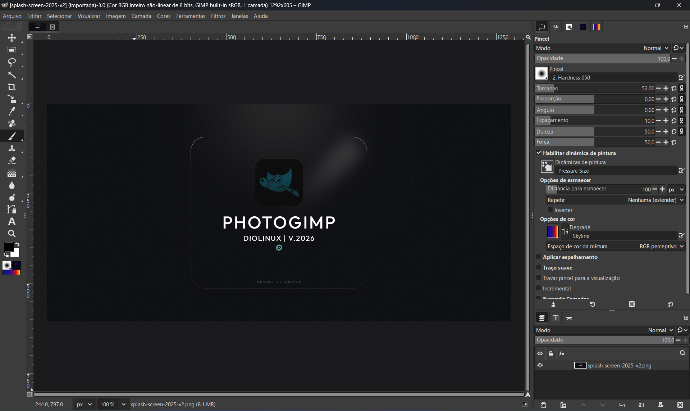

# 🎨 PhotoGIMP


[](https://github.com/Diolinux/PhotoGIMP)
[](https://www.gnu.org/licenses/gpl-3.0)
[](https://github.com/Diolinux/PhotoGIMP/releases/latest)

**PhotoGIMP** is a free, community-driven patch that transforms [GIMP](https://www.gimp.org/) (GNU Image Manipulation Program) into a layout that feels familiar to **Adobe Photoshop** users. If you're switching from Photoshop to GIMP and want to feel at home right away, PhotoGIMP is for you.

> **New to GIMP?** GIMP is a free and open-source image editor available for Linux, macOS, and Windows. It can do most things Photoshop can — photo retouching, image composition, graphic design, and more — all for free. PhotoGIMP just makes it *look and feel* more like Photoshop.

---

## ✨ Features

- **Photoshop-like tool layout** — Tools are reorganized to mimic the positions you're used to in Adobe Photoshop.
- **Custom Splash Screen** — A unique PhotoGIMP splash screen greets you on startup.
- **Maximized canvas space** — Default settings are optimized to give you the largest possible working area.
- **Photoshop keyboard shortcuts** — Keyboard shortcuts follow [Adobe's official documentation](https://helpx.adobe.com/photoshop/using/default-keyboard-shortcuts.html) for the Windows version.
- **Custom icon & name** — A dedicated `.desktop` file gives PhotoGIMP its own icon and app name in your system menu.

---

## 📷 Screenshots

<p>
  
  <em>PhotoGIMP Diolinux Splash Art</em>
</p>

<p>
  
  <em>GIMP 3.0 with the PhotoGIMP patch applied</em>
</p>

---

## 📋 Requirements

Before installing PhotoGIMP, make sure you have:

| Requirement | Details |
|---|---|
| **GIMP 3.0 or newer** | Download from: [gimp.org](https://www.gimp.org/downloads/) or [Flathub](https://flathub.org/apps/org.gimp.GIMP) (Linux) |
| **Run GIMP at least once** | GIMP needs to generate its config files before PhotoGIMP can overwrite them. **Install GIMP → open it → close it → then install PhotoGIMP.** |

---

## ⚙ How to Install

> [!WARNING]
> **Back up your current GIMP settings before installing!** PhotoGIMP overwrites GIMP's configuration files. If you have custom settings you want to keep, save a backup copy first. See the backup instructions in each section below.

---

### 🐧 Flatpak (Linux)


#### Backup (optional)

If you want to keep your current GIMP settings, back them up first:

```bash
cp -r ~/.config/GIMP/3.0 ~/GIMP-3.0-backup
```

#### Install

1. Make sure you already have GIMP installed [from Flathub](https://flathub.org/apps/org.gimp.GIMP).
2. **Open GIMP once, then close it** — this creates the config folders that PhotoGIMP needs.
3. Download the latest release:
   👉 **[Download PhotoGIMP for Linux (.zip)](https://github.com/Diolinux/PhotoGIMP/releases/download/3.0/PhotoGIMP-linux.zip)**
4. Extract the `.zip` file **into your home folder** (`~`).
   - This will place files into `~/.config` and `~/.local`, which are hidden folders.
   - To see hidden folders in your file manager, press <kbd>Ctrl</kbd> + <kbd>H</kbd>.
   - When prompted about existing files, choose **"Replace"** or **"Overwrite"**.
5. Open GIMP — you should see the new PhotoGIMP layout! 🎉

<details>
<summary><strong>💡 Using a non-Flatpak GIMP?</strong></summary>

If you installed GIMP from your distro's package manager (apt, dnf, pacman, etc.) instead of Flatpak, the config folder is in the same location (`~/.config/GIMP/3.0`), so the steps above still work. Just make sure you have GIMP version 3.0 or newer.
</details>

---

### 🪟 Windows


#### Backup (optional)

If you want to keep your current GIMP settings, back them up first:

1. Press <kbd>Windows</kbd> + <kbd>R</kbd> to open the Run dialog.
2. Type `%APPDATA%\GIMP` and press <kbd>Enter</kbd>.
3. Copy the entire `3.0` folder to a safe location (e.g., your Desktop).

#### Install

1. Make sure you have [GIMP installed from the official website](https://www.gimp.org/downloads/).
2. **Open GIMP once, then close it** — this creates the config folders that PhotoGIMP needs.
3. Download the latest release:
   👉 **[Download PhotoGIMP for Windows (.zip)](https://github.com/Diolinux/PhotoGIMP/releases/download/3.0/PhotoGIMP.zip)**
4. Extract the contents of `PhotoGIMP.zip` to any folder (e.g., your Desktop).
5. Open the extracted folder and **copy the `3.0` folder**.
6. Press <kbd>Windows</kbd> + <kbd>R</kbd> to open the Run dialog.
7. Type `%APPDATA%\GIMP` and press <kbd>Enter</kbd> — this opens GIMP's settings folder.
8. **Paste** the `3.0` folder here.
9. When prompted about existing files, select **"Replace the files in the destination"**.
10. Open GIMP — you should see the new PhotoGIMP layout! 🎉

<details>
<summary><strong>💡 Optional: Change the GIMP shortcut icon</strong></summary>

You can also download [photogimp.ico](https://github.com/Diolinux/PhotoGIMP/releases/download/3.0/photogimp.ico) and update the icon on the GIMP shortcut located at:

```
%appdata%\Microsoft\Windows\Start Menu\Programs\GIMP 3.0.0
```

Right-click the shortcut → **Properties** → **Change Icon** → browse to the downloaded `.ico` file.
</details>

<details>
<summary><strong>🍫 Install via Chocolatey (alternative)</strong></summary>

If you use [Chocolatey](https://chocolatey.org/), you can install PhotoGIMP with a single command:

```powershell
choco install photogimp
```

Maintained by: [André Augusto](https://github.com/AndreAugustoDev)
</details>

---

### 🍎 macOS


#### Backup (optional)

If you want to keep your current GIMP settings, back them up first:

1. Open Finder.
2. Press <kbd>Cmd</kbd> + <kbd>Shift</kbd> + <kbd>G</kbd> and go to `~/Library/Application Support/GIMP`.
3. Copy the entire `GIMP` folder to a safe location (e.g., your Desktop).

#### Install

1. Make sure you have [GIMP installed from the official website](https://www.gimp.org/downloads/).
2. **Open GIMP once, then close it** — this creates the config folders that PhotoGIMP needs.
3. Download the latest release:
   👉 **[Download PhotoGIMP for macOS (.zip)](https://github.com/Diolinux/PhotoGIMP/releases/download/3.0/PhotoGIMP.zip)**
4. Extract the contents of `PhotoGIMP.zip` to any folder (e.g., your Desktop).
5. Open the extracted folder and **copy the `3.0` folder**.
6. Open Finder, press <kbd>Cmd</kbd> + <kbd>Shift</kbd> + <kbd>G</kbd> to open "Go to Folder".
7. Type `~/Library/Application Support/GIMP` and press <kbd>Enter</kbd>.
8. If you see a `2.10` folder from a previous installation, **delete it** to avoid conflicts.
9. **Paste** the `3.0` folder inside the GIMP folder.
10. When prompted about existing files, select **"Replace"** or **"Merge"**.
11. Open GIMP — you should see the new PhotoGIMP layout! 🎉

---

## 📦 What's Inside the Patch

PhotoGIMP replaces or adds the following files in GIMP's configuration directory:

| File / Folder | What it does |
|---|---|
| `shortcutsrc` | Keyboard shortcuts mapped to match Photoshop |
| `toolrc` | Tool configuration and ordering |
| `sessionrc` | Window layout and panel positions |
| `dockrc` | Dock / panel configuration |
| `gimprc` | General GIMP preferences (canvas, grid, etc.) |
| `contextrc` | Active tool/color context settings |
| `splashes/` | Custom PhotoGIMP splash screen |
| `theme.css` | Minor UI theme adjustments |
| `templaterc` | Pre-defined canvas templates |

On Linux, the patch also installs:
- A custom `.desktop` file (app launcher with PhotoGIMP name and icon)
- A custom application icon in `~/.local/share/icons/`

---

## 🗑 How to Uninstall

To remove PhotoGIMP and restore GIMP to its default state, simply delete GIMP's config folder and reopen GIMP — it will regenerate fresh default settings.

### Linux

```bash
rm -rf ~/.config/GIMP/3.0
```

Then open GIMP again — it will create a brand new default configuration.

If you made a backup earlier, restore it instead:

```bash
cp -r ~/GIMP-3.0-backup ~/.config/GIMP/3.0
```

### Windows

1. Press <kbd>Windows</kbd> + <kbd>R</kbd>, type `%APPDATA%\GIMP` and press <kbd>Enter</kbd>.
2. Delete the `3.0` folder.
3. Open GIMP — it will recreate the default settings.

Or restore your backup by pasting the backed-up `3.0` folder back.

### macOS

1. Open Finder, press <kbd>Cmd</kbd> + <kbd>Shift</kbd> + <kbd>G</kbd>.
2. Go to `~/Library/Application Support/GIMP`.
3. Delete the `3.0` folder.
4. Open GIMP — it will recreate the default settings.

Or restore your backup by pasting the backed-up folder back.

---

## ❓ Troubleshooting / FAQ

> [!CAUTION]
> **PhotoGIMP does not have an official website.** The only official source for the project is its GitHub repository: https://github.com/Diolinux/PhotoGIMP/

<details>
<summary><strong>PhotoGIMP didn't change anything — GIMP looks the same</strong></summary>

- Make sure you extracted the files to the **correct location**. The most common mistake is extracting to the wrong folder.
- **Linux**: The `.config` and `.local` folders must be in your home directory (`~`). They are hidden — press <kbd>Ctrl</kbd> + <kbd>H</kbd> in your file manager to see them.
- **Windows**: The `3.0` folder must be inside `%APPDATA%\GIMP`, not next to it.
- **macOS**: The `3.0` folder must be inside `~/Library/Application Support/GIMP`.
- Did you **close GIMP** before pasting the files? GIMP may overwrite incoming settings on exit.
</details>

<details>
<summary><strong>I get an error when opening GIMP after installing PhotoGIMP</strong></summary>

- This usually means the GIMP version doesn't match. PhotoGIMP is built for **GIMP 3.0+**. If you're running GIMP 2.x, it won't be compatible.
- Try deleting the config folder and reinstalling — see the [How to Uninstall](#-how-to-uninstall) section.
</details>

<details>
<summary><strong>Can I use PhotoGIMP with GIMP 2.10?</strong></summary>

No. This version of PhotoGIMP is designed exclusively for **GIMP 3.0 and newer**. The configuration format changed significantly between GIMP 2.x and 3.x.
</details>

<details>
<summary><strong>Will PhotoGIMP delete my custom brushes, fonts, or plug-ins?</strong></summary>

No. PhotoGIMP only replaces configuration files (shortcuts, layout, preferences). Your personal brushes, fonts, gradients, and plug-ins remain untouched.
</details>

<details>
<summary><strong>Can I customize the shortcuts after installing PhotoGIMP?</strong></summary>

Absolutely! PhotoGIMP just sets a starting point. You can change any shortcut in GIMP via **Edit → Keyboard Shortcuts**.
</details>

<details>
<summary><strong>How do I update PhotoGIMP to a new version?</strong></summary>

Just download the latest release and follow the installation steps again — it will overwrite the previous PhotoGIMP configuration.
</details>

---

## 🤝 Contributing

Found a bug? Have a suggestion? We'd love your help!

- **Report an issue**: [Open an issue](https://github.com/Diolinux/PhotoGIMP/issues)
- **Submit a fix**: [Create a pull request](https://github.com/Diolinux/PhotoGIMP/pulls)
- **Translate**: Help us translate the README into more languages! See the [Translations](#-translations) section.

---

## 🌍 Translations

This README is available in other languages:

- 🇧🇷 [Português (Brazilian Portuguese)](./docs/README_pt.md)
- 🇵🇱 [Polski (Polish)](./docs/README_pl.md)

Want to add your language? Fork the repo, create a `docs/README_xx.md` file, and submit a pull request!

---

## 🏆 Credits

- This project would not be possible without the amazing [GIMP](https://www.gimp.org/) team.
- A BIG thanks to all Diolinux's supporters on [YouTube](https://youtube.com/Diolinux).
- Splash screen & icons from [Adriel Filipe Design](https://bento.me/adrielfilipedesign).

---

## 👥 Contributors

<a align="center" href="https://github.com/Diolinux/PhotoGIMP/graphs/contributors">
  
</a>

---

## 📄 License

PhotoGIMP is licensed under the [GNU General Public License v3.0](./LICENSE).
