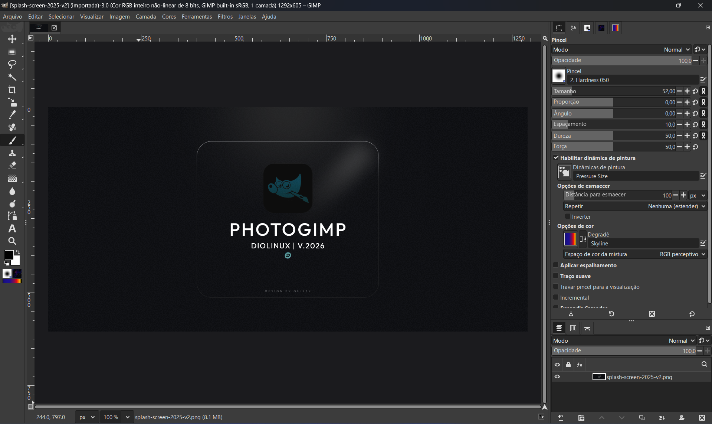

# 🎨 PhotoGIMP

Prosta modyfikacja do GIMP-a 3.0+, aby pomóc użytkownikom Adobe Photoshop, zawierająca funkcje takie jak:

* Zmiana położenia narzędzi, podobna do Adobe Photoshop-a;
* Nowy Ekran Ładowania;
* Nowe domyślne ustawienia, zwiększające przestrzeń roboczą;
* Skróty klawiaturowe, przypominające z Photoshop-a, wzorowane na dokumentacji Adobe;
* Nowa ikona i nazwa dla dowolnego pliku .desktop.

## 📷 Zrzuty Ekranu

  
  <em>PhotoGIMP Diolinux Splash Art</em>

  
  <em>GIMP 3.0 z zastosowanym patchem PhotoGIMP</em>

## ⚙ Jak Zainstalować

Ten patch został pierwotnie opracowany do pracy z wersją Flatpak GIMP-a dla Linuxa, ale może być używany w prawie każdym formacie pakietu bez ograniczeń, poprzez wyodrębnienie plików do odpowiednich folderów.

### Flatpak (Linux)

Aby zainstalować najnowszą wersję PhotoGIMP na swoim systemie Linux używając Flatpak, wykonaj następujące proste kroki:

1. Upewnij się, że masz już zainstalowany GIMP [z Flathub](https://flathub.org/apps/org.gimp.GIMP);
2. **Uruchom i zamknij GIMP-a po instalacji przed kontynuowaniem!**
3. Pobierz pliki z tego repozytorium [lub kliknij tutaj](https://github.com/Diolinux/PhotoGIMP/releases/download/3.0/PhotoGIMP-linux.zip);
4. Rozpakuj zawartość pliku zip do folderu domowego (`.config` i `.local` - to są ważne) i nadpisz pliki jeśli to konieczne;
5. Gotowe, ciesz się! :smile:

### Windows

Aby zainstalować najnowszą wersję PhotoGIMP na Windows:

1. Upewnij się, że masz już zainstalowany [GIMP ze strony oficjalnej](https://www.gimp.org/downloads/);
2. **Uruchom i zamknij GIMP-a po instalacji przed kontynuowaniem!**
3. Pobierz pliki z tego repozytorium lub [kliknij tutaj](https://github.com/Diolinux/PhotoGIMP/releases/download/3.0/PhotoGIMP.zip);
4. Rozpakuj zawartość pliku `PhotoGIMP.zip` do folderu według własnego wyboru;
5. Skopiuj folder `3.0`;
6. Przytrzymaj klawisz <kbd>Windows</kbd> i naciśnij <kbd>R</kbd>, aby otworzyć okno dialogowe *Uruchom*;
7. Wpisz `%APPDATA%\GIMP` w oknie dialogowym i naciśnij <kbd>Enter</kbd>;
8. Wklej folder `3.0` do folderu GIMP-a, który właśnie otworzyłeś;
9. Gdy pojawi się pytanie o istniejące pliki, wybierz "Zastąp pliki w miejscu docelowym";
10. Gotowe, ciesz się! :smile:

:bulb: Wskazówki:
- Opcjonalnie możesz również pobrać [photogimp.ico](https://github.com/Diolinux/PhotoGIMP/releases/download/3.0/photogimp.ico) i zaktualizować ikonę skrótu w `%appdata%\Microsoft\Windows\Start Menu\Programs\GIMP 3.0.0`;
- Jeśli chcesz wykonać kopię zapasową swoich obecnych ustawień GIMP-a przed instalacją PhotoGIMP, skopiuj cały folder `3.0` z `%APPDATA%\GIMP` w bezpieczne miejsce przed kontynuowaniem instalacji.

### macOS

Aby zainstalować najnowszą wersję PhotoGIMP na macOS:

1. Upewnij się, że masz już zainstalowany [GIMP ze strony oficjalnej](https://www.gimp.org/downloads/);
2. **Uruchom i zamknij GIMP-a po instalacji przed kontynuowaniem!**
3. Pobierz pliki z tego repozytorium lub [kliknij tutaj](https://github.com/Diolinux/PhotoGIMP/releases/download/3.0/PhotoGIMP.zip);
4. Rozpakuj zawartość pliku `PhotoGIMP.zip` do folderu według własnego wyboru;
5. Skopiuj folder `3.0`;
6. Otwórz Finder, naciśnij <kbd>Cmd</kbd> + <kbd>Shift</kbd> + <kbd>G</kbd>, aby otworzyć "Idź do folderu";
7. Wpisz `~/Library/Application Support/GIMP` i naciśnij <kbd>Enter</kbd>;
8. Jeśli masz folder `2.10` z poprzedniej instalacji, usuń go, aby uniknąć konfliktów;
9. Wklej folder `3.0` do folderu GIMP;
10. Gdy pojawi się pytanie o istniejące pliki, wybierz "Zastąp" lub "Scal";
11. Gotowe, ciesz się! :smile:

:bulb: Wskazówki:
- Jeśli chcesz wykonać kopię zapasową swoich obecnych ustawień GIMP-a przed instalacją PhotoGIMP, skopiuj cały folder GIMP z `~/Library/Application Support/GIMP` w bezpieczne miejsce przed kontynuowaniem instalacji.

## Podziękowania

* Ten projekt nie byłby możliwy bez wspaniałego zespołu GIMP-a.
* Wielkie podziękowania dla wszystkich zwolenników Diolinux na [YouTube](https://youtube.com/Diolinux).
* Ekran powitalny i ikony od [Adriel Filipe Design](https://bento.me/adrielfilipedesign)

## Współtwórcy

