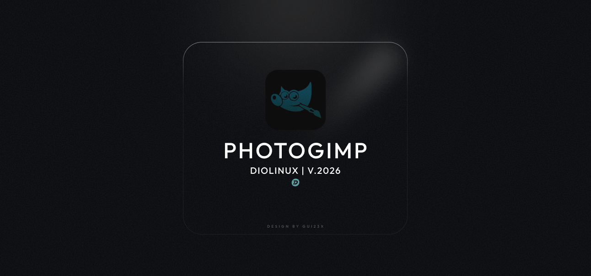
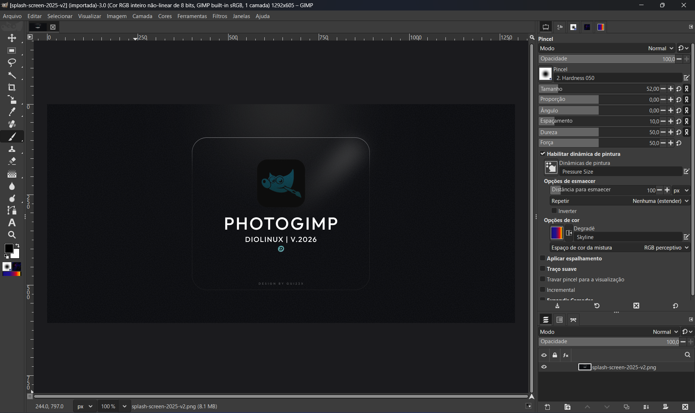

# 🎨 PhotoGIMP


[](https://github.com/Diolinux/PhotoGIMP)
[](https://www.gnu.org/licenses/gpl-3.0)
[](https://github.com/Diolinux/PhotoGIMP/releases/latest)

**PhotoGIMP** 是一個由社群驅動的免費修補程式，可將 [GIMP](https://www.gimp.org/)（GNU Image Manipulation Program）轉變為 **Adobe Photoshop** 使用者熟悉的版面配置。如果你正從 Photoshop 轉向 GIMP 並希望快速上手，PhotoGIMP 就是為你準備的。

> **第一次接觸 GIMP？** GIMP 是一款免費、自由且開放原始碼的影像編輯器，適用於 Linux、macOS 和 Windows。Photoshop 能做的，它大部分也能做——相片修飾、影像合成、圖形設計等——而且完全免費。PhotoGIMP 只是讓它*看起來和用起來*更像 Photoshop。

---

## ✨ 特性

- **類 Photoshop 的工具佈局** — 工具依照 Adobe Photoshop 中的位置重新排列，還原你熟悉的操作體驗。
- **自訂啟動畫面** — 啟動時迎接你的是 PhotoGIMP 專屬的啟動畫面。
- **最大化畫布空間** — 預設設定經過最佳化，為你提供盡可能大的工作區域。
- **Photoshop 鍵盤快速鍵** — 快捷鍵參考 [Adobe 官方文件](https://helpx.adobe.com/photoshop/using/default-keyboard-shortcuts.html) 中 Windows 版本的設定。
- **自訂圖示與名稱** — 專屬的 `.desktop` 檔案讓 PhotoGIMP 在系統選單中擁有獨立的圖示與應用程式名稱。

---

## 📷 截圖

<p>
  
  <em>原 PhotoGIMP Diolinux 啟動畫面</em>
</p>

<p>
  
  <em>GIMP 3.0 應用 PhotoGIMP 修補程式後的效果</em>
</p>

---

## 📋 安裝要求

安裝 PhotoGIMP 前，請確認符合以下條件：

| 要求 | 詳情 |
|---|---|
| **GIMP 3.0 或更高版本** | 下載位置：[gimp.org](https://www.gimp.org/downloads/) 或 [Flathub](https://flathub.org/apps/org.gimp.GIMP)（Linux） |
| **至少執行過一次 GIMP** | GIMP 需要先產生設定檔，然後 PhotoGIMP 才能覆蓋它們。**先安裝 GIMP → 開啟 → 關閉 → 再安裝 PhotoGIMP。** |

---

## ⚙ 安裝方法

> [!WARNING]
> **安裝前請備份你的 GIMP 當前設定！** PhotoGIMP 會覆蓋 GIMP 的設定檔。如果你想保留自訂設定，請先儲存一份備份。具體備份步驟見下方各平臺說明。

---

### 🐧 Flatpak（Linux）


#### 備份（可選）

如果你想保留目前的 GIMP 設定，請先備份：

```bash
cp -r ~/.config/GIMP/3.0 ~/GIMP-3.0-backup
```

#### 安裝

1. 確認已[從 Flathub](https://flathub.org/apps/org.gimp.GIMP) 安裝 GIMP。
2. **先開啟一次 GIMP，然後關閉**——這將建立 PhotoGIMP 所需的設定資料夾。
3. 下載最新 release：
   👉 **[下載 PhotoGIMP for Linux (.zip)](https://github.com/Diolinux/PhotoGIMP/releases/download/3.0/PhotoGIMP-linux.zip)**
4. 將 `.zip` 檔案解壓**到你的家目錄**（`~`）中。
   - 這會將檔案放入 `~/.config` 與 `~/.local`，這些是隱藏資料夾。
   - 要在檔案管理器中檢視隱藏資料夾，請按 <kbd>Ctrl</kbd> + <kbd>H</kbd>。
   - 當提示覆蓋已有檔案時，選擇 **"Replace"** 或 **"Overwrite"**。
5. 開啟 GIMP——你應該看到全新的 PhotoGIMP 界面配置了！🎉

<details>
<summary><strong>💡 使用的是非 Flatpak 版 GIMP？</strong></summary>

如果你是使用發行版套件管理器（apt、dnf、pacman 等）而非 Flatpak 安裝的 GIMP，設定資料夾的位置相同（`~/.config/GIMP/3.0`），因此上述步驟同樣適用。只需確認 GIMP 版本為 3.0 或更高。
</details>

---

### 🪟 Windows


#### 備份（可選）

如果你想保留目前的 GIMP 設定，請先備份：

1. 按下 <kbd>Windows</kbd> + <kbd>R</kbd> 開啟執行對話方塊。
2. 輸入 `%APPDATA%\GIMP` 並按 <kbd>Enter</kbd>。
3. 將整個 `3.0` 資料夾複製到安全位置（例如桌面）。

#### 安裝

1. 確認已[從官方網站](https://www.gimp.org/downloads/)安裝 GIMP。
2. **先開啟一次 GIMP，然後關閉**——這將建立 PhotoGIMP 所需的設定資料夾。
3. 下載最新 release：
   👉 **[下載 PhotoGIMP for Windows (.zip)](https://github.com/Diolinux/PhotoGIMP/releases/download/3.0/PhotoGIMP.zip)**
4. 將 `PhotoGIMP.zip` 的內容解壓到任意資料夾（例如桌面）。
5. 開啟解壓後的資料夾，**複製其中的 `3.0` 資料夾**。
6. 按下 <kbd>Windows</kbd> + <kbd>R</kbd> 開啟執行對話方塊。
7. 輸入 `%APPDATA%\GIMP` 並按 <kbd>Enter</kbd>——這將開啟 GIMP 的設定資料夾。
8. 將 `3.0` 資料夾**貼上**到此處。
9. 當提示覆蓋已有檔案時，選擇 **"Replace the files in the destination"**。
10. 開啟 GIMP——你應該看到全新的 PhotoGIMP 界面配置了！🎉

<details>
<summary><strong>💡 可選：更改 GIMP 捷徑圖示</strong></summary>

你也可以下載 [photogimp.ico](https://github.com/Diolinux/PhotoGIMP/releases/download/3.0/photogimp.ico)，然後更新以下路徑中 GIMP 捷徑的圖示：

```
%appdata%\Microsoft\Windows\Start Menu\Programs\GIMP 3.0.0
```

右鍵點選捷徑 → **屬性** → **更改圖示** → 瀏覽到下載的 `.ico` 檔案。
</details>

<details>
<summary><strong>🍫 透過 Chocolatey 安裝（替代方式）</strong></summary>

如果你使用 [Chocolatey](https://chocolatey.org/)，可以透過一條命令安裝 PhotoGIMP：

```powershell
choco install photogimp
```

維護者：[André Augusto](https://github.com/AndreAugustoDev)
</details>

---

### 🍎 macOS


#### 備份（可選）

如果你想保留目前的 GIMP 設定，請先備份：

1. 開啟 Finder。
2. 按下 <kbd>Cmd</kbd> + <kbd>Shift</kbd> + <kbd>G</kbd>，前往 `~/Library/Application Support/GIMP`。
3. 將整個 `GIMP` 資料夾複製到安全位置（例如桌面）。

#### 安裝

1. 確認已[從官方網站](https://www.gimp.org/downloads/)安裝 GIMP。
2. **先開啟一次 GIMP，然後關閉**——這將建立 PhotoGIMP 所需的設定資料夾。
3. 下載最新 release：
   👉 **[下載 PhotoGIMP for macOS (.zip)](https://github.com/Diolinux/PhotoGIMP/releases/download/3.0/PhotoGIMP.zip)**
4. 將 `PhotoGIMP.zip` 的內容解壓到任意資料夾（例如桌面）。
5. 開啟解壓後的資料夾，**複製其中的 `3.0` 資料夾**。
6. 開啟 Finder，按下 <kbd>Cmd</kbd> + <kbd>Shift</kbd> + <kbd>G</kbd> 開啟"前往資料夾"。
7. 輸入 `~/Library/Application Support/GIMP` 並按 <kbd>Enter</kbd>。
8. 如果你看到之前安裝遺留的 `2.10` 資料夾，請**將其刪除**以避免衝突。
9. 將 `3.0` 資料夾**貼上**到 GIMP 資料夾內。
10. 當提示覆蓋已有檔案時，選擇 **"Replace"** 或 **"Merge"**。
11. 開啟 GIMP——你應該看到全新的 PhotoGIMP 界面配置了！🎉

<details>
<summary><strong>替代方式：透過終端機安裝</strong></summary>

如果 Finder 的 **「Merge」** 選項會靜態略過既有檔案，或者你偏好使用命令列，可以使用 `rsync` 來複製 PhotoGIMP 檔案。

1. 開啟終端機（Terminal）。
2. 執行 `rsync`，將 `/path/to/extracted/3.0/` 替換為你解壓縮後的 `3.0` 資料夾位置：

   ```bash
   rsync -av --ignore-times /path/to/extracted/3.0/ ~/Library/Application\ Support/GIMP/3.0/
   ```

   請確認兩個路徑結尾都有 `/`。
3. 如果你安裝的 GIMP 使用不同的版本資料夾，請將目的地路徑改為對應版本（例如若為 GIMP 3.2，則使用 `~/Library/Application\ Support/GIMP/3.2/`）。

</details>

---

## 📦 修補程式內容說明

PhotoGIMP 會替換或新增 GIMP 設定目錄中的以下檔案：

| 檔案 / 資料夾 | 作用 |
|---|---|
| `shortcutsrc` | 對映為 Photoshop 風格的鍵盤快捷鍵 |
| `toolrc` | 工具設定與排序 |
| `sessionrc` | 視窗配置與面板設定 |
| `dockrc` | 面板 / 停駐區配置 |
| `gimprc` | GIMP 通用偏好設定（畫布、網格等） |
| `contextrc` | 目前工具 / 顏色情境設定 |
| `splashes/` | 自訂 PhotoGIMP 啟動畫面 |
| `theme.css` | 輕微調整的 UI 主題 |
| `templaterc` | 預設畫布範本 |

在 Linux 上，此修補程式還會另外安裝：
- 一個自訂的 `.desktop` 檔案（包含 PhotoGIMP 名稱與圖示的啟動器）
- 一個位於 `~/.local/share/icons/` 的自訂應用程式圖示

---

## 🗑 如何解除安裝

要移除 PhotoGIMP 並將 GIMP 恢復為預設狀態，只需刪除 GIMP 的設定資料夾然後重新開啟 GIMP——它會自動產生全新的預設設定。

### Linux

```bash
rm -rf ~/.config/GIMP/3.0
```

然後重新開啟 GIMP——它會產生全新的預設設定。

如果你之前做過備份，可以將其還原：

```bash
cp -r ~/GIMP-3.0-backup ~/.config/GIMP/3.0
```

### Windows

1. 按下 <kbd>Windows</kbd> + <kbd>R</kbd>，輸入 `%APPDATA%\GIMP` 並按 <kbd>Enter</kbd>。
2. 刪除 `3.0` 資料夾。
3. 開啟 GIMP——它會重新建立預設設定。

或者將之前備份的 `3.0` 資料夾貼上回來以恢復設定。

### macOS

1. 開啟 Finder，按下 <kbd>Cmd</kbd> + <kbd>Shift</kbd> + <kbd>G</kbd>。
2. 前往 `~/Library/Application Support/GIMP`。
3. 刪除 `3.0` 資料夾。
4. 開啟 GIMP——它會重新建立預設設定。

或者將之前備份的資料夾貼回原位置以恢復設定。

---

## ❓ 疑難排解 / 常見問題

> [!CAUTION]
> **PhotoGIMP 沒有官方網站。** 該專案的唯一官方來源是其 GitHub 儲存庫：https://github.com/Diolinux/PhotoGIMP/

<details>
<summary><strong>PhotoGIMP 沒有任何變化——GIMP 看起來和原來一樣</strong></summary>

- 請確認你將檔案解壓到了**正確的位置**。最常見的問題就是解壓到了錯誤的資料夾。
- **Linux**：`.config` 與 `.local` 資料夾必須位於你的家目錄（`~`）中。它們是隱藏資料夾——在檔案管理器中按 <kbd>Ctrl</kbd> + <kbd>H</kbd> 即可看到。
- **Windows**：`3.0` 資料夾必須在 `%APPDATA%\GIMP` 裡面，而不是放在外層。
- **macOS**：`3.0` 資料夾必須在 `~/Library/Application Support/GIMP` 裡面。
- 你在貼上檔案之前**關閉 GIMP** 了嗎？GIMP 退出時可能會覆蓋傳入的設定。
</details>

<details>
<summary><strong>安裝 PhotoGIMP 後開啟 GIMP 時顯示錯誤</strong></summary>

- 這通常意味著 GIMP 版本不匹配。PhotoGIMP 專為 **GIMP 3.0+** 建置。如果你執行的是 GIMP 2.x，將不相容。
- 嘗試刪除設定資料夾後重新安裝——參見[如何解除安裝](#-如何解除安裝)部分。
</details>

<details>
<summary><strong>可以在 GIMP 2.10 上使用 PhotoGIMP 嗎？</strong></summary>

不可以。此版本的 PhotoGIMP 專為 **GIMP 3.0 及更高版本**設計。GIMP 2.x 與 3.x 之間的配置格式發生了重大變更。
</details>

<details>
<summary><strong>PhotoGIMP 會刪除我的自訂筆刷、字型或外掛嗎？</strong></summary>

不會。PhotoGIMP 只替換設定檔（快捷鍵、界面配置、偏好設定）。你的個人筆刷、字型、漸變與外掛不會受到影響。
</details>

<details>
<summary><strong>安裝 PhotoGIMP 後可以自訂快捷鍵嗎？</strong></summary>

當然可以！PhotoGIMP 只是提供一個起點。你可以在 GIMP 中透過 **編輯（Edit）→ 鍵盤快捷鍵（Keyboard Shortcuts）** 修改任何快捷鍵。
</details>

<details>
<summary><strong>如何將 PhotoGIMP 更新到新版本？</strong></summary>

只需下載最新 release 並按照安裝步驟重新操作即可——它會覆蓋之前的 PhotoGIMP 設定。
</details>

---

## 🤝 貢獻

發現 Bug？有建議？歡迎貢獻你的力量！

- **報告問題**：[提交 Issue](https://github.com/Diolinux/PhotoGIMP/issues)
- **提交修正**：[建立 Pull Request](https://github.com/Diolinux/PhotoGIMP/pulls)
- **翻譯**：幫助我們將 README 翻譯成更多語言！參見[翻譯](#-翻譯)部分。

---

## 🌍 翻譯

本 README 提供以下語言的版本：

- 🇬🇧 [English (英文)](../README.md)
- 🇮🇹 [Italiano (義大利文)](./README_it.md)
- 🇵🇱 [Polski (波蘭語)](./README_pl.md)
- 🇺🇦 [Українська (烏克蘭語)](./README_ua.md)
- 🇧🇷 [Português (巴西葡萄牙語)](./README_pt.md)
- 🇷🇺 [Русский (俄羅斯語)](./README_ru.md)
- 🇪🇸 [Español (西班牙語)](./README_es.md)
- 🇮🇱 [עברית (希伯來語)](./README_he.md)
- 🇰🇷 [Korean (韓文)](./README_ko.md)
- 🇨🇳 [简体中文 (簡體中文)](./README_zh.md)
- 🇹🇼 [繁體中文（台灣）](./README_zh-TW.md)

想要新增你的語言？Fork 本儲存庫，建立 `docs/README_xx.md` 檔案，然後提交 Pull Request！

---

## 🏆 致謝

- 沒有出色的 [GIMP](https://www.gimp.org/) 團隊，就不會有這個專案。
- 衷心感謝 [YouTube](https://youtube.com/Diolinux) 上所有 Diolinux 的支持者。
- 啟動畫面與圖示由 [Adriel Filipe Design](https://bento.me/adrielfilipedesign) 提供。

---

## 👥 貢獻者

<a align="center" href="https://github.com/Diolinux/PhotoGIMP/graphs/contributors">
  
</a>

---

## 📄 許可證

PhotoGIMP 基於 [GNU General Public License v3.0](../LICENSE) 許可。
